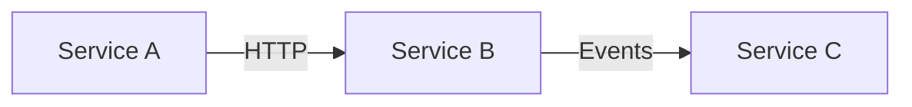

# Cross-Service Research

Research across multiple repositories and save findings to Obsidian.

## Constraints

- **Read-only**: Never modify source code unless explicitly asked. This skill is for research and planning.
- **Ignore worktrees**: Directories with a `.git` file (not directory) are worktrees. Skip them unless explicitly asked.
- **Output to Obsidian**: Write all findings to Obsidian via CLI. See [Output to Obsidian](#output-to-obsidian).

## Setup

Before starting, determine:

1. **Base path** — The workspace directory containing repos (e.g., `/Users/milton/Workspaces/K/`)
2. **Vault** — Ask the user which Obsidian vault to use. Always pass `vault="<name>"` to the CLI.

To list main repos (skip worktrees):

```bash
for dir in <base_path>/*/; do
  [ -d "$dir/.git" ] && echo "$(basename $dir)"
done
```

## Research Workflow

### 1. Scope the Research

Clarify what the user needs. Common patterns:

- **Data flow**: How data moves from service A to B (endpoints, events, shared DBs)
- **Schema/contract**: What models or API contracts services share
- **Pattern comparison**: How different services solve the same problem
- **Feature planning**: What services a new feature will touch

### 2. Discover Relevant Services

Use `warpgrep_codebase_search` as the **primary search tool** — it runs parallel grep+read with natural language queries, ideal for broad cross-repo exploration.

```
mcp__morph-mcp__warpgrep_codebase_search(
  search_string="<natural language description>",
  repo_path="<base_path>/<service>"
)
```

### 3. Search Strategy

**Preferred: `warpgrep_codebase_search`** — Exploratory, broad, or complex searches. Describe what you're looking for in natural language. Run multiple calls in parallel across repos.

**Fallback: `Grep`** — Precise pattern matching when you know the exact regex within an already-identified scope.

```
Grep pattern="@(app|router)\.(get|post|put|delete|patch)" path="<base_path>/<service>/"
Grep pattern="(BASE_URL|SERVICE_URL|httpx|requests\.)" path="<base_path>/<service>/"
Grep pattern="class \w+(BaseModel|Base):" path="<base_path>/<service>/app/"
```

### 4. Trace Inter-Service Communication

| Pattern | How to Find |
|---------|-------------|
| HTTP calls between services | warpgrep for "HTTP calls to other services" or Grep for `httpx`, `requests`, base URLs |
| Shared libraries | Check for common dependency packages |
| Message queues / events | warpgrep for "event publishing" or Grep for queue/topic names |
| Shared databases | Grep for connection strings, model imports |

### 5. Parallel Multi-Repo Search

Launch parallel warpgrep calls — one per repo:

```
warpgrep(search_string="<query>", repo_path="<base_path>/service-a")
warpgrep(search_string="<query>", repo_path="<base_path>/service-b")
warpgrep(search_string="<query>", repo_path="<base_path>/service-c")
```

## Output to Obsidian

Save all research to Obsidian using the `obsidian` CLI. Target vault: `vault="<vault_name>"` (ask user at start).

Base folder: `Projects/Research/<mission>/` where `<mission>` is a short kebab-case name (e.g., `auth-flow`, `whatsapp-routing`).

### Creating notes

Use `obsidian create` with `silent` to avoid opening each note:

```bash
obsidian vault="<vault>" create path="Projects/Research/<mission>/Summary.md" content="<content>" silent
```

For appending to existing notes:

```bash
obsidian vault="<vault>" append path="Projects/Research/<mission>/Summary.md" content="<content>"
```

### Document structure per mission

Create these notes as needed:

| Note | Purpose |
|------|---------|
| `Summary` | Always create. Overview + conclusions + open questions. Links to other notes. |
| `<Service> Findings` | Per-service deep dives |
| `Flow` | Data/control flow descriptions with mermaid diagrams |
| `Comparison` | Side-by-side pattern comparisons across services |

### Note format

Use Obsidian Flavored Markdown. See the `obsidian-markdown` skill for full syntax reference.

- **Properties** (frontmatter): Include `tags`, `date`, and `mission` for each note
- **Wikilinks**: Use `[[note]]` to link between research notes in the same mission
- **Callouts**: Use `> [!important]`, `> [!warning]`, `> [!info]` for key findings
- **Mermaid diagrams**: For architecture and flow visualizations
- **Code references**: Include `file_path:line_number` format for all key code locations

Example Summary note content:

````markdown
---
tags:
  - research
  - cross-service
date: <today>
mission: <mission-name>
---

# <Mission Title>

> [!abstract] TL;DR
> One paragraph answering the research question.

## Services Involved

- [[<Service A> Findings]]
- [[<Service B> Findings]]

## Key Findings

> [!important] Finding 1
> Description with `path/to/file.py:42` reference.

## Architecture



## Open Questions

- [ ] Question 1
- [ ] Question 2
````

### Checking for existing research

Before creating notes, search the vault to avoid duplicates:

```bash
obsidian vault="<vault>" search query="<mission-name>" limit=5
```

## Team-Based Research

For large missions spanning 3+ services, use `TeamCreate` to parallelize. Each teammate investigates one or more services concurrently.

### Setup

```
TeamCreate(team_name="research-<mission>", description="Cross-service research: <objective>")
```

### Task structure

1. Create one task per service or per research question
2. Spawn `general-purpose` teammates with `team_name`
3. Each teammate:
   - Receives mission context and assigned service(s)
   - Uses warpgrep/Grep to investigate (read-only)
   - Returns findings as text (lead writes to Obsidian)
4. The lead (you) consolidates and writes all notes to Obsidian
5. Clean up teams with `TeamDelete`

### Teammate prompt template

```
You are researching a codebase. Your mission: <objective>.
Your assigned service(s): <service-list> at <base_path>/<service>/

Rules:
- READ-ONLY. Do not modify any source code.
- Ignore worktree directories (those with a .git file instead of directory).
- Use warpgrep_codebase_search as primary search tool.
- Return findings as structured text with file_path:line_number references.
- Mark your task complete when done.
```

### When to use teams vs solo

| Scenario | Approach |
|----------|----------|
| Quick lookup in 1-2 services | Solo with warpgrep |
| Tracing a flow across 2-3 services | Solo with parallel warpgrep calls |
| Broad research across 3+ services | Team — one teammate per service |

## Tips

- **warpgrep first, Grep second**: Start broad, narrow down.
- Launch **parallel warpgrep calls** across repos — one per repo in the same message.
- Always ask for vault name before writing to Obsidian.
- Use `obsidian search` to check for existing research before creating duplicates.
- If a service map exists for the workspace (like a `references/service-map.md`), read it first to orient.
